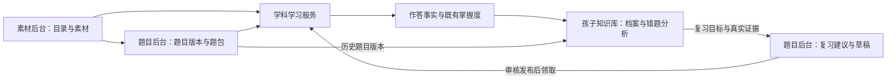

# 孩子知识库详细开发文档

> **文档状态：已获用户授权进入开发。** 下文保留原始验收标准；已实施内容、验证结果和剩余限制以 [执行记录](../../../diagnosis-admin/docs/knowledge-base-documentation/progress.md) 为准。未执行的验收不能因已有实现而视为通过。
>
> **For agentic workers:** 仅在用户另行明确要求开始开发后，使用 `subagent-driven-development` 或 `executing-plans` 按任务执行。本文不能作为自动开始开发的授权。

**Goal：** 让家长直观看到孩子已掌握哪些能力、具体答错哪些题，并将有真实作答依据的分析转为题目后台可执行的复习建议，最终查看复习后的表现。

**Architecture：** `diagnosis-admin` 读取学习事实与既有掌握度，按素材后台的知识目录组织档案、错题和分析。复习建议经知识库提交，由 `task-admin` 持久化、校验、生成和管理题包；孩子作答仍由学科学习服务记账，知识库读取后续事实呈现效果。

**Tech Stack：** 沿用 Go、Gin、GORM、PostgreSQL，前端沿用 React、TypeScript、React Router、TanStack Query、Vite、Vitest。SQLite 用于轻量单测，跨来源查询和并发幂等必须用独立 PostgreSQL 验证。不新增独立学习数据库、消息队列或分析服务。

**编制日期：** 2026-09-12。现状依据当前工作区代码阅读，未查询正式孩子数据，未检查运行镜像。仓库处于多项工作并行修改状态，执行前应重新确认本文件列出的接口和文件。

**阅读导航：** [产品与范围](#1-产品定位与决定) · [页面](#5-页面与交互规格) · [数据口径](#6-数据口径) · [分析规则](#8-错误分析规则-v1) · [接口](#9-只读-api-契约) · [复习交接](#10-复习建议交接契约) · [开发任务](#16-开发任务与依赖) · [验收](#17-测试夹具与验收矩阵) · [部署](#18-配置兼容上线与回退)

## 1. 产品定位与决定

### 1.1 核心问题

知识库回答三个连续的问题：

1. **会了什么：** 这个孩子截至现在，哪些知识点的哪些能力已经掌握？
2. **错了什么：** 当时做了哪道题、选了什么或写了什么、正确答案是什么？
3. **接下来复习什么：** 多次错误说明哪些内容值得补练，题目后台应按什么要求出题，复习后表现如何？

数据来源的关系为：素材后台提供知识目录和素材来源，题目后台或学科学习服务提供实际题目，孩子的真实作答决定哪些是错题。为了展示掌握与改进，必须读取正确和错误的全部真实作答，不能只保存错误。

### 1.2 与原产品说明的关系

本方案落实本次对话的新要求，在原 `AGENTS.md` 和 `diagnosis-admin/孩子知识库.md` 的基础上明确两项扩展：

- 知识库可以按知识点和题型展示“已经会了什么”，并显示已有掌握证据；进度后台仍负责按日、周、月展示练习量和新掌握日期。
- 知识库可以提交复习建议并查看后续处理；学习事实与掌握度仍然只读，题包生成、发布和归档仍归题目后台。

现有识字矩阵、日历和时间趋势继续留在进度后台。知识库采用可筛选的知识条目与能力详情，不复制整张识字矩阵。

执行时先同步上述产品说明，避免后续开发者将新能力误读为越界。本次文档编制不修改这些既有说明，也不修改业务代码。

### 1.3 选择的方案

| 方案 | 结果与代价 | 决定 |
|---|---|---|
| 仅改名和调整首页 | 改动小，但错题难以理解，无法形成可靠复习依据 | 不作为完整交付 |
| 建立知识档案、证据完整的错题本、复习建议交接 | 可以沿用现有学习账本与题包能力，分阶段形成完整流程 | 采用 |
| 先上全面自动诊断和自动发布复习 | 对记录完整度要求高，当前各学科来源不一致，错误结论会影响出题 | 不纳入首版 |

## 2. 范围与学科覆盖

### 2.1 首版必须完成

- 三个主入口：“会了什么”“错了什么”“复习建议”。
- 所有学科已有正式作答和掌握记录的基本目录展示，按实际记录覆盖程度标识。
- 识字新题包回执、拼音运行时回执的完整读取；旧计划记录按可证实程度降级展示。
- 按学科、模块、知识点、题型查询知识档案和错题，支持分页。
- 修正单次错误被称为反复错误、未练被称为弱、无记录被称为稳定等判断。
- 识字跨多次已完成练习的复习建议、题目后台接收、草稿生成、发布后作答关联和效果展示。
- 对已有错题但暂不支持出题的学科，保留分析，明确显示接入状态。

### 2.2 首版不包含

- 修改掌握度算法、手动标记已掌握、重新评分历史笔迹。
- 知识库编题、配图、生成音频或直接发布题包。
- 自动发布、按日历自动排课、复习完成后递归自动生成任务。
- 从仅在浏览器存在的示例题成绩补造学习记录。
- 将没有完整来源的旧错题伪装成可精确重放的原题。
- 全学科统一的心理或认知原因诊断，以及对“粗心、理解差”等人格化判断。

### 2.3 首版覆盖表

| 来源 | 知识与技能展示 | 具体错题 | 自动生成复习草稿 |
|---|---|---|---|
| 识字新题包正式作答 | 完整，读取已有技能状态 | 回执、稳定选项、版本快照；手写含笔迹与提示 | 首版支持，来源计划必须已完成 |
| 识字原有独立练习、旧计划 | 有真实账本就展示 | 按原始记录能力区分完整、部分、不可还原 | 不冒充新回执；不支持的来源返回明确原因 |
| 拼音新运行时练习 | 字母与音节按各自技能展示 | 实例快照、稳定选项、回执 | 首版分析可见；题目后台接入拼音复习属于下一阶段 |
| 英语、算数、科普的正式计划 | 读取已有账本；算数按模块读取技能 | 旧计划及专用回执适配，缺失部分注明 | 首版不将普通出题接口冒充定向复习接口 |
| 英语短句、成语正式计划 | 按知识点已有掌握记录展示 | 以旧计划可恢复信息为限 | 后续按学科扩展 |
| 古诗内存练习、逻辑和部分学科试玩入口 | 仅展示共享库里实际存在的其他正式记录 | 当前入口没有持久化证据时不纳入 | 显示该入口尚未接入学习记录 |

“已接入某学科”必须细化到练习入口，不能从某学科存在一个正式 API 推断首页全部题型都记账。素材目录有内容也不等于孩子已经练过。

当前 `task-admin` 已有识字与算术普通题包；当前复习生成仍由识字 `taskgen/review.go` 实现。算术普通题包存在不代表算术复习与孩子领取已经贯通。

## 3. 当前实现与必须修正的差距

| 当前依据 | 已有能力或问题 | 本方案处理 |
|---|---|---|
| `diagnosis-admin/frontend/src/pages/OverviewPage.tsx` | 学科健康度、掌握计数占据首页 | 改为知识条目、能力筛选与具体内容 |
| `KpArchivePage.tsx` | 最近错选显示 picks 和原始 answer | 使用面向家长的题目与答案组件 |
| `diagnosis/service.go: ErrorPatterns` | 去重后直接标记反复错误，没有重复次数条件 | 使用可核对的独立作答与实际选项内容聚合 |
| 同文件 `skillGapsWhere` | not_started 可被称为弱 | 单列未练，弱项须有实际作答证据 |
| 同文件 `healthOf` | 全部未开始也可能显示稳定 | 无记录与少量证据独立呈现 |
| 同文件 `KpArchive` | `SkillsFor(subject, "")` 丢失模块条件 | 读取 moduleCode，再取模块需要的技能 |
| 同文件历史查询 | 只连接通用新题回执，不连接拼音专用回执 | 统一来源适配，保留拼音实例与 skillCode |
| 旧错题查询 | 依赖 plan_items.status=wrong | 作答对错以 attempts 为准，不能据计划项最终状态删去错误 |
| 旧选项处理 | 显示下标与原始答案下标直接比较 | 使用保存的 option_order 映射，并验证来源可关联 |
| `taskgen/review.go` | 从一个已完成识字计划生成复习 | 新增跨计划证据集合入口，保留旧接口 |
| `handler_review_evidence.go` | 已能还原复习来源选项和手写，无分页 | 复用取证思路，新增有孩子范围的分页查询 |

科普计划项完成状态可能是 `completed`，其中仍可能存在错误作答。孩子重试后答对，也不能把此前错误事实抹去。上述问题应由数据读取测试锁定，不能只改显示文字。

## 4. 系统分工与数据流



| 对象 | 唯一负责方 | 知识库的权限 |
|---|---|---|
| 知识目录、素材修订 | 素材后台及现有目录维护流程 | 读取标识、名称和允许查看的历史媒体 |
| 真实作答、评分、掌握度 | 学科学习服务与 shared-go | 读取，不补写、不重评 |
| 知识档案与错误规律 | diagnosis-admin | 按规则计算只读视图 |
| 复习建议、用户采纳、出题运行记录 | task-admin | 经服务接口创建、读取和归档建议 |
| 题包草稿、题目版本、发布 | task-admin | 查看和跳转；在该后台完成发布 |
| 复习后表现 | diagnosis-admin 读取已关联作答计算 | 展示事实和样本量，不修改学习状态 |

知识库数据库连接保持只读语义。新增 POST 仅作题目后台的同源代理，不在知识库另建一份建议表。题目后台不可用时，档案与错题继续可读；提交建议显示可重试错误。

## 5. 页面与交互规格

### 5.1 外壳和路由

品牌统一为“孩子知识库”，显示孩子姓名。删除“病历”“学科健康度”“诊断台”等医疗化措辞与装饰。页面说明采用“根据已记录的练习整理”，技术来源细节收进详情。

| 页面 | 路由 | 行为 |
|---|---|---|
| 会了什么 | `/` | 学科选择、知识搜索、能力筛选和知识列表 |
| 学科知识 | `/subjects/:code` | 同一列表固定学科，可按模块筛选 |
| 知识点档案 | `/knowledge-points/:kpId` | 各技能状态、错题、后续作答 |
| 错了什么 | `/wrongs` | 按题逐条看或按知识点与题型归类 |
| 一次作答详情 | `/attempts/:attemptId` | 原题、选项或笔迹与证据完整度 |
| 复习建议 | `/reviews` | 候选分析、已保存建议及处理状态 |
| 复习建议详情 | `/reviews/:suggestionId` | 理由、来源、生成结果、题包链接与后续效果 |

旧 `/patterns` 重定向到 `/wrongs?view=patterns`；旧学科、知识点深链接保留。游戏不进入本轮学习分析。保留现有 appPath/base path 行为。

筛选条件写入 URL：subject、module、q、view、skill、state。切换孩子时清空选择的证据和候选建议，查询缓存必须包含 childId。

### 5.2 会了什么

顶部是学科选择与知识搜索，下面显示三个可点击的计数：“已练知识点”“有已掌握能力的知识点”“有错题的知识点”。三个数允许重叠，不画成互斥占比图。

默认展示已经练过的知识点，每条优先呈现已会的能力；提供“全部已练、已掌握能力、待巩固、未练”筛选。列表按目录 orderNo、kpId 稳定排序。“未练”需要主动切换，不淹没默认列表。

每行包含知识名称、学科与模块、能力摘要、真实练习次数、错题次数、最近练习时间。时间是属性和排序依据，不增加日历主界面。

示例（虚构，用于界面验收）：

> 山 · 识字第 1 组  
> 看字选义：已掌握；看义选字：已掌握；听音写字：待巩固  
> 已记录 8 次作答，其中 2 次错误。查看档案。

知识点整体未掌握但某技能已掌握时，必须让该技能出现在“已掌握能力”筛选结果中。不能仅按知识点整体 status 过滤。

### 5.3 知识点档案

按以下顺序展示：

1. 各技能的已有掌握状态，以及该技能有多少次可核对作答。
2. 仍值得关注的错误和未独立完成的练习。
3. 具体错题；每条可查看原题和后续表现。
4. 分页的全部作答，默认最近在前，可切换只看错误。
5. 与该知识点相关的复习建议和已关联题包。

零样本正确率显示“暂无记录”，不能显示 0%。没有练过的技能写“尚未练习”；练过但样本少写“已练 N 次”，不自动加“弱”。有历史掌握状态但缺少历史明细时显示状态并注明“历史作答明细不完整”。

### 5.4 错题本

顶部筛选学科、模块、知识点、题型；提供“仍需关注”和“全部历史”视图。“提示后完成”是独立筛选，不冒充错误。

逐题视图包含：题目摘要、孩子的实际答案、正确答案、时间、来源、后续表现。题干不能只有知识点名称。图片保持原比例，音频由用户点击播放，页面打开不自动播放。

归类视图以“知识点 × 技能/题型”为主键，显示错误次数、独立题目数、最近证据、已掌握状态和具体混淆对象。点击进入该组的作答列表。

选中若干组后生成复习建议预览。尚未完成计划、来源不足或学科不支持的项目仍可看，但显示具体的不可提交原因。

### 5.5 作答现场

选择题显示当时选项顺序、正确项、孩子选项。不能把“第 2 项”当作选项内容。手写题显示原始笔迹、是否使用提示、当时结果；评分政策名称放在展开的记录详情中。

历史手写不重新调用评估器，不把“模板匹配未通过”写成“笔顺错误”，不从笔迹自行推断孩子写成了另一个字。

缺失快照或媒体时保留可验证的信息，并明确显示缺失项。例如“已记录答错，未保存当时选项”；不能用今天的素材覆盖历史画面。

### 5.6 复习建议

分为“可整理的建议”和“已保存建议”。候选建议只计算，不自动落库、不自动出题。

家长查看理由和证据，调整目标题量与重练方式后点击“提交复习建议”。题目后台持久化建议；点击“生成复习草稿”才启动生成。两个动作都不发布。

详情逐项显示生成结果，提供题目后台深链接。父级建议允许关联多个题包，不能只显示第一个任务。复习完成后显示每个目标的作答次数、独立正确次数、提示次数、是否已有掌握变化。

## 6. 数据口径

### 6.1 基本粒度

| 名称 | 定义 |
|---|---|
| 知识点 | `knowledge_points.id`，通过 module 连接 subject |
| 能力 | 学科、模块允许的 skillCode；题型与能力不默认一一对应 |
| 一次真实作答 | `attempts.id`；回执是该事实的补充，不另算一次 |
| 已练知识点 | 当前孩子至少有一条真实作答的 kpId 去重集合 |
| 有已掌握能力的知识点 | 至少一个适用技能处于 mastered/review_due；无拆分技能的学科看已有知识点状态 |
| 错题次数 | 真实作答中 is_correct=false 的次数；同题两次错误是两次作答 |
| 错题道数 | 能可靠标识的题目版本或实例去重数；不明确时返回 null |
| 错题涉及知识点 | 错误作答中的 kpId 去重数 |
| 已掌握 | 原学习服务保存的掌握状态；不由知识库的统计阈值生成 |

总目录数、已练数和已掌握数要分别命名。不能把素材总量叫作孩子积累量。

### 6.2 作答去重与关联

1. 先按 childId 读取 `attempts`，使用 `(childId, attemptId)` 作为统一事实标识。`parent_mark` 是家长标记，`game` 属于游戏；两者不纳入真实练习数、正确率、错题与复习证据。历史档案可单独展示家长标记。`source=quiz` 记录按已有学习事实处理，但不能仅凭这个字符串证明具体入口和计划；未知 source 单列为来源不明，不混入核心计数。
2. 对该事实做至多一份来源适配；优先精确外键关联，不能把多张回执表直接 JOIN 成多对多再计数。
3. `question_attempt_receipts.attempt_id`、`pinyin_answer_receipts.attempt_id` 是精确关联。
4. 科普专用回执使用 `(child_id, client_id)` 与 attempts 匹配，校验 kpId/questionId 一致，再取 planId/itemId。
5. 旧 attempts 没有通用 planItemId 外键。禁止按“时间相近、同一题、同一知识点”猜测来源计划。无可靠关联时展示作答事实与来源不完整状态。
6. `plan_items` 的最终状态和累计 picks 是补充证据，不作为新增 attempt，也不能覆盖每次作答对错。

重复网络请求命中原 clientId 的情况只计原 attempt。分析“重复错误”时还需将同一题内重试与独立题目分开。

### 6.3 统计与提示

- `observedAttempts`、`observedCorrect`：所有真实观察结果，包括提示后的真实结果。
- `independentAttempts`、`independentCorrect`：来源明确说明未使用提示或帮助的作答。
- `assistedAttempts`：明确有帮助的作答。
- `unknownAssistanceAttempts`：历史来源不能确认是否有帮助的作答。
- `accuracy = observedCorrect / observedAttempts`；分母为零返回 null。
- `independentAccuracy = independentCorrect / independentAttempts`；分母为零返回 null。

四类计数不能混用。未知帮助情况不能自动补成“独立完成”；现有 mastery counters 与事实次数不同是允许的，界面应解释它们分别代表掌握证据和实际练习。

适配器可以在已核验的服务契约明确没有提示操作时判为 none，例如当前拼音实例选择题和识字版本选择题；这必须由来源版本白名单确认，不能以缺少 hintsUsed 字段作为通用依据。手写以保存的 payload/evaluation 确认提示；旧自评、家长标记及不明来源不能证明独立完成。

已有掌握状态来自家长标记或缺少独立作答明细时，展示“账本标记已掌握”及证据说明，不把它写成孩子通过练习取得的结果。无法可靠判断状态来源时保留账本状态并注明来源不完整，不推断原因。

### 6.4 技能和到期

技能集合统一通过 `mastery.SkillsFor(subjectCode, moduleCode)` 读取：

| 学科/模块 | 适用技能 |
|---|---|
| 识字 | glyph_sense、sense_char、write_char |
| 拼音字母 | listen、inword、shape |
| 拼音 syllables | blend |
| 算数 add10/sub10 | calc、story |
| 算数 shape | find、name |
| 英语 | listen、picture |
| 科普 | recognize |

中文题型名优先复用现有契约，补齐拼音 shape/blend 等缺失标签；不直接把英文 code 展示给家长。不再参与掌握的历史题型仍保留历史记录，但不算缺失能力。

`mastered` 且 dueAt 已过时可展示“已掌握 · 到期复习”。到期不等于变弱；应作为复习时机，不能归为错误原因。

## 7. 统一作答证据与历史恢复

### 7.1 来源适配表

| adapter | 关联表 | 精确标识 | 能力 |
|---|---|---|---|
| literacy_version | attempts → question_attempt_receipts → question_versions；校验 plan_items 快照 | attemptId、receiptId、questionVersionId | 稳定选项/笔迹/评估/版本媒体 |
| pinyin_instance | attempts → pinyin_answer_receipts → pinyin_quiz_instances | attemptId、childId+clientId、instanceId | 题干、选项、稳定答案、技能 |
| science_plan | attempts → science_attempt_receipts → plan_items | childId+clientId、planId/itemId | 计划来源；具体选项恢复程度看所存字段 |
| legacy_attempt | attempts 与可确认的题库元数据 | attemptId | 对错与耗时；不保证当时题目可还原 |

拼音回执没有数字 receiptId，不能设计一个只支持 int64 receiptId 的全学科接口。上述来源是当前首版范围，新增学科专用回执需新增适配器及验收，不改写旧事实。

### 7.2 证据质量字段

题目、选项、媒体、帮助状态分别标注质量，不用一个“完整”布尔值掩盖差异：

- `questionFidelity`: `frozen_version` / `instance_snapshot` / `plan_snapshot_unverified` / `current_reference` / `missing`。
- `selectionFidelity`: `stable_option` / `verified_order` / `missing`。
- `mediaFidelity`: `immutable` / `mutable_reference` / `missing`。
- `assistance`: `none` / `hinted` / `unknown`。

009 迁移曾从迁移时题库回填旧 plan_items；`content_snapshot_version=1` 本身不能证明是当时原题。未能证实创建来源的旧计划快照一律标记 `plan_snapshot_unverified`。

当前题库参考可供家长理解知识内容，但要标记“当前题目参考”，不能参与“孩子当时选了这张图”的陈述，也不能生成声称原题重放的任务。

### 7.3 选项映射

新回执优先用稳定 selectedOptionId 在保存的选项中查找；正确项来自保存的答案标识。显示顺序只用于画面恢复。

旧记录只有在该次作答与计划项可精确关联、option_order 完整且通过排列校验时，才允许将显示下标映射回原始选项。缺少任何一个条件都不猜测。

跨题目的“混淆同一内容”使用素材知识点标识或保存的语义标识；题目内的 optionId 不保证跨版本稳定，不能直接跨题归组。没有跨题内容标识时，只归纳“同一题多次错”，不说“总把甲认成乙”。

### 7.4 手写与媒体

听写读取 `answer_payload_json`、`evaluation_json`、`evaluator_version`，按保存的归一化坐标绘制只读笔迹。不得把标准模板传入可提交的练习组件，也不得借历史查看触发判题。

新增知识库同源媒体接口。服务端从本次作答的已验证引用解析资源，只允许固定配置的内部素材服务和已确认的媒体路径；前端不能提交任意 URL 让后端代取。

媒体策略：识字冻结媒体按修订引用；拼音实例媒体如果仍指向可变资源，展示可变引用标记；历史资源不存在时返回结构化 missing，不替换最新图片。历史查看即使题包撤回、归档仍应可用。

## 8. 错误分析规则 V1

所有规则版本固定为 `knowledge-analysis-v1`。它们用于整理建议，不更改掌握度。阈值是首版产品规则，不能宣称为经过教育效果验证的诊断标准。

### 8.1 证据窗口与独立性

- 档案、错题本保留全部历史；分析默认查看截至 analysisAsOf 最近 30 天的作答。
- 每个知识点与技能最多取最近 20 个独立练习实例；按 createdAt、attemptId 固定顺序。
- 独立实例键：新题包为 planItemId，拼音为 instanceId；无法识别实例的旧作答可列事实，不参与要求独立次数的强结论。
- 同一实例内重试保留明细；“初次作答表现”按首个可确认作答计算。答错后马上重试答对，不抹掉初次错误，也不作为另一个独立成功实例。
- 独立完成必须 assistance=none；unknown 不计入独立正确样本。

### 8.2 规则表

| ruleCode | 触发条件 | 展示结论 | 复习方向 |
|---|---|---|---|
| observed_wrong | 至少 1 条可确认错误 | 曾在该题型答错，列出次数 | 单次原题检查；不称反复 |
| repeated_skill_error | 至少 3 个独立实例，其中至少 2 个首答错误 | 该题型多次出错，显示分子分母 | 相同知识点与题型补练 |
| repeated_confusion | 至少 2 个不同实例错选同一可确认语义内容 | 多次把 A 选成 B，显示来源 | 保留实际混淆内容作干扰项 |
| practiced_skill_gap | 同知识点某技能已掌握，另一技能有真实练习且状态 shaky，或满足 repeated_skill_error | 指明已经会的技能和需补练技能 | 补练弱项 |
| assisted_completion | 至少 1 次明确提示后完成 | 这次在提示后完成 | 建议独立尝试，独立于错题 |

未练过、只练一次但答对、到期复习、单次耗时较长，均不能触发“能力薄弱”。耗时只作为作答详情，不纳入首版原因规则。

手写“未通过”按照当时评估结果归类；不推断混淆字、笔顺或书写习惯。

### 8.3 关注状态

用于错题列表的 `followUpState` 与掌握状态分开：

- `no_later_practice`：错误之后无可确认的同知识点同技能作答。
- `still_wrong`：最近一个后续实例初次作答仍错。
- `answered_correctly_later`：有后续正确，尚不足以说明稳定。
- `mastered_later`：同技能当前已掌握，且有晚于该错误的可确认独立成功证据。
- `insufficient_evidence`：后续来源或帮助情况无法确认。

建议优先展示仍错、反复混淆、练过的技能缺口，再展示单次错误和提示完成。排序为规则优先级、最近错误时间降序、证据数量降序、kpId/skillCode 升序，保证稳定。

### 8.4 候选建议数量

默认取同学科最多 4 个目标；每个目标默认 3 题，总计最多 12 题。用户可调每目标 1–10 题，总数 1–20。题型、目标、数量都以题目后台能力校验为准。

API 的 `mode=mixed` 对应“原题加变式”，默认每目标 1 道可用原题，其余为变式。若没有可用原题或变式容量不足，显示实际容量并要求调整；不靠重复同一快照填满配额。`original_only` 不得超过可用不同原题数。首版不增加 variant_only 模式，也不把已有强项的题目当作弱项目标题型的原题。

目标超过 4 个时保留在候选列表，可分次创建建议，不自动把所有旧错题一次性塞入任务。

## 9. 只读 API 契约

本节接口均为拟新增，统一前缀 `/api/v1/children/:cid/knowledge`，JSON 使用 lowerCamelCase。原 `/diagnosis/*`、`/error-patterns` 与旧档案响应兼容保留，由适配层转换，避免原页面或链接一起失效。

### 9.1 接口列表

| 方法与路径（相对上述前缀） | 用途 |
|---|---|
| `GET /summary` | 学科入口、去重计数、来源覆盖 |
| `GET /points` | 知识点列表，筛选已练/能力/模块/关键词 |
| `GET /points/:kpId` | 档案头、技能、可用证据摘要 |
| `GET /points/:kpId/attempts` | 分页全部或错误作答 |
| `GET /wrongs` | 分页错误事实或按知识点技能分组 |
| `GET /attempts/:attemptId` | 一次作答现场 |
| `GET /attempts/:attemptId/media/:mediaId` | 经验证的历史媒体 |
| `GET /review-candidates` | 有证据的复习候选，不持久化 |
| `GET /review-suggestions` | 代理题目后台的当前孩子建议列表 |
| `GET /review-suggestions/:id` | 代理建议和任务状态 |
| `GET /review-suggestions/:id/outcomes` | 读取关联的后续作答并汇总效果 |

`points` 允许 subject、module、q、state、skill；`wrongs` 增加 view=attempts/groups/patterns 与 followUpState。q 去空白，最多 80 个字符，参数化查询。

### 9.2 通用分页

```json
{
  "items": [],
  "nextCursor": null,
  "hasMore": false,
  "evidenceAsOf": "2026-09-12T12:00:00Z",
  "stateReadAt": "2026-09-12T12:00:01Z",
  "coverage": {"level": "partial", "reasonCodes": ["legacy_selection_missing"]}
}
```

limit 默认 20、上限 100。作答列表排序使用 `(createdAt DESC, attemptId DESC)`；知识点使用 `(orderNo, kpId)` 游标。游标包含当前孩子、过滤条件摘要、首屏记录上界和最后一项排序键；过滤条件变化必须重新取首屏。知识点跨模块排序时使用 `(subject.orderNo,module.orderNo,kp.orderNo,kpId)`，所有 orderNo 均按数值升序。

`evidenceAsOf` 与 maxAttemptId 一起固定本次分页的作答上界。它不代表历史掌握快照；掌握度按 `stateReadAt` 读取当前状态。首版避免给汇总排序加会随新作答变化的分页键；一个列表会话内需要的聚合从同一作答上界计算。

按“已掌握能力/待巩固”筛选知识点时，游标还绑定首屏 masteryRevision 和 catalogRevision。两者分别为当前孩子适用技能有效状态集合、目录标识与排序集合的规范化摘要；下页请求重新比对，若成员条件已变化返回 409 `list_changed`，前端提示“学习记录已更新，刷新列表”，不能静默改变集合导致跳项。作答事实分页不因单纯掌握状态变化而中断。

损坏、跨孩子、过滤不一致的游标返回 400。不存在或不属于该孩子的作答返回 404。空集合是 200，数据库错误是 503，不能把数据库错误伪装为“暂无错题”。

### 9.3 核心类型（接口定义示例）

```ts
type Assistance = 'none' | 'hinted' | 'unknown'
type SourceRef =
  | { kind: 'literacy_version'; receiptId: number; questionVersionId: number }
  | { kind: 'pinyin_instance'; instanceId: string; clientId: string }
  | { kind: 'science_plan'; clientId: string; planId: number; itemId: number }
  | { kind: 'legacy_attempt' }

type PracticeStats = {
  observedAttempts: number
  observedCorrect: number
  independentAttempts: number
  independentCorrect: number
  assistedAttempts: number
  unknownAssistanceAttempts: number
  accuracy: number | null
  independentAccuracy: number | null
}

type SkillSummary = {
  skillCode: string
  label: string
  masteryStatus: string
  practiced: boolean
  dueAt: string | null
  stats: PracticeStats
  evidenceCoverage: 'complete' | 'partial' | 'missing'
}

type AttemptEvidence = {
  attemptId: number
  childId: number
  kpId: number
  subjectCode: string
  moduleCode: string
  skillCode: string | null
  questionType: string | null
  occurredAt: string
  isCorrect: boolean
  costMs: number
  assistance: Assistance
  source: SourceRef
  planId: number | null
  planItemId: number | null
  questionFidelity: 'frozen_version' | 'instance_snapshot' | 'plan_snapshot_unverified' | 'current_reference' | 'missing'
  selectionFidelity: 'stable_option' | 'verified_order' | 'missing'
  mediaFidelity: 'immutable' | 'mutable_reference' | 'missing'
  reviewEligible: boolean
  reviewBlockReasons: string[]
}
```

`AttemptEvidence` 是摘要，attemptId 只在顶层出现；保存建议的 evidence 也采用同样的 attemptId + SourceRef 组合。详情使用以下联合类型：

```ts
type JsonValue = null | boolean | number | string | JsonValue[] | { [key: string]: JsonValue }
type EvidenceOption = {
  id: string
  label: string | null
  semanticId: string | null
  imageMediaId: string | null
  audioMediaId: string | null
}
type QuestionView = {
  interaction: 'choice' | 'handwriting' | 'reference'
  stem: { text: string | null; imageMediaId: string | null; audioMediaId: string | null }
  options: EvidenceOption[]
  answerOptionId: string | null
  targetText: string | null
  visual: { kind: string; payload: JsonValue } | null
}
type ResponseView =
  | { kind: 'choice'; selectedOptionId: string | null }
  | {
      kind: 'handwriting'
      strokes: Array<Array<{ x: number; y: number; t: number }>>
      hintsUsed: number | null
      evaluation: { outcome: 'passed' | 'failed' | 'unknown'; details: JsonValue }
      evaluatorVersion: string | null
    }
  | { kind: 'unknown'; reasonCodes: string[] }
type AttemptDetail = AttemptEvidence & {
  question: QuestionView | null
  response: ResponseView
  evidenceReasonCodes: string[]
}
```

options 按可验证的当时顺序返回；不能恢复时保持参考顺序并由 selectionFidelity 标注。手写 x/y 在 0–1，t 为相对毫秒；适配器从原始 payload 转为该显示格式，不改写原记录。unknown 不默认选第 0 项。无数据使用 null 或空数组，不把空字符串 JSON 传到界面直接显示。

服务端返回的 mediaId 是该作答内的资源标识，不是任意 URL。新 API 的时间为带时区 ISO 8601，前端统一按 Asia/Shanghai 展示。

## 10. 复习建议交接契约

### 10.1 保存、生成、发布三个动作

本方案确定为显式分步：

1. 知识库 GET 候选建议：仅计算，不能调用会冻结素材的旧 `PreviewReview`。
2. POST 保存建议：题目后台校验并持久化要求与来源，返回建议编号，不出题。
3. POST 生成草稿：创建持久化生成运行，按目标和识字组生成题包草稿。
4. 家长进入题目后台检查、试做、调整和发布；发布继续使用原有接口。

当前 `PreviewReview` 的 mixed 分支可能执行素材 Freeze，不可当作无副作用的知识库预览。建议候选只说明证据和推荐要求；准确生成容量在题目后台校验。

### 10.2 任务侧接口与知识库代理

任务侧前缀为 `/api/v1/children/:cid/review-suggestions`；知识库同源代理前缀为 `/api/v1/children/:cid/knowledge/review-suggestions`。

| 方法/相对路径 | 行为与返回 |
|---|---|
| `POST /` | 保存建议；201；相同幂等请求重放为 200 |
| `GET /` | 分页建议列表 |
| `GET /:id` | 固定要求、来源摘要、最新生成状态 |
| `GET /:id/evidence` | 分页已核验来源 |
| `GET /:id/tasks` | 分页关联任务及实际发布状态 |
| `GET /:id/plans` | 分页已领取计划与状态 |
| `POST /:id/generate` | 启动生成；202，返回 runId |
| `POST /:id/retry` | 仅重试指定未成功分片；202 |
| `POST /:id/cancel` | 停止未完成生成；200，返回最新状态 |
| `POST /:id/archive` | 归档建议并停止未完成生成；200 |

`outcomes` 是知识库自行计算的只读接口，不由题目后台给出“已经掌握”的结论。

### 10.3 保存请求

以下数字均为接口示例，不能作为正式孩子数据执行：

```json
{
  "schemaVersion": 1,
  "title": "山的听写复习",
  "analysisVersion": "knowledge-analysis-v1",
  "analysisAsOf": "2026-09-12T12:00:00Z",
  "subjectCode": "literacy",
  "targets": [
    {
      "key": "103:write_char",
      "kpId": 103,
      "questionType": "write_char",
      "reasonCode": "repeated_skill_error",
      "mode": "mixed",
      "requestedCount": 3,
      "preferredDistractorKpIds": [],
      "evidence": [
        {
          "attemptId": 5001,
          "role": "target_error",
          "source": {
            "kind": "literacy_version",
            "receiptId": 701,
            "questionVersionId": 201
          }
        },
        {
          "attemptId": 5008,
          "role": "target_error",
          "source": {
            "kind": "literacy_version",
            "receiptId": 709,
            "questionVersionId": 205
          }
        },
        {
          "attemptId": 5012,
          "role": "target_observation",
          "source": {
            "kind": "literacy_version",
            "receiptId": 712,
            "questionVersionId": 208
          }
        }
      ]
    }
  ]
}
```

请求头必须有 `Idempotency-Key`。路径给出唯一 childId，请求体不重复传 childId。上例 role 第三项可包含一次正确首答，以核对“3 个独立实例中 2 次错误”的分母，不能只提交失败样本后声称完整正确率。

一份建议一个学科，最多 20 个目标、200 条去重证据、1 MB 请求体；每目标 1–10 题，总计 1–20 题。默认由候选界面限制到 4 个目标。target.key 必须等于规范化的 `kpId:questionType`，不得重复。

`role` 为 target_error、target_observation、assisted_completion、supporting_strength。最后一类只能解释同知识点的另一种已会能力，不能作为目标题型的原题来源。

`preferredDistractorKpIds` 为软偏好，仅允许来自已核验的实际错选内容。无法保留时返回原因；首版不提供必须包含某干扰项的硬约束。手写题该数组必须为空。

### 10.4 服务端校验顺序

1. 校验结构、长度、计数、analysisVersion 和模式，拒绝未知字段与非法枚举。
2. 校验目标知识点属于所选学科，题型适用于目标模块；模块和识字组由数据库解析。
3. 查每个 attempt，排除家长标记、游戏及来源不明记录。
4. 校验孩子、kpId、回执、计划项、题目版本、来源实例一致；跨孩子或互相矛盾时整份请求拒绝，不生成部分结果。
5. 按 role 校验对错、提示状态、目标题型；按 analysisAsOf 与第 8 节窗口重建该目标的分子、分母和独立实例。要求提交的证据覆盖该结论使用的错误与正确观察，不允许只选错误样本后声称整个窗口的表现。校验 reasonCode 和语义标识，不接受客户端自由文字作为分析事实。
6. 保存服务器生成的 reasonText、证据摘要、来源引用和分析版本。请求中 analysisAsOf 只限定分析时点，不能替代服务端验真。
7. 生成前再次校验支持的学科、来源完整度、来源计划完成状态、现有出题能力和素材容量。

首版保留“来源计划已完成”的约束：正在练习中的错误可在知识库查看，但不用于启动生成，返回 `source_plan_incomplete`。这是本方案的产品选择，避免孩子本轮尚在订正时就建立复习任务。是否放宽到已提交但计划未完成的回执，不纳入首版。

### 10.5 保存与生成响应

保存成功后 `generationStatus=null`，只表示建议已保存：

```json
{
  "id": 41,
  "rowVersion": 1,
  "lifecycle": "open",
  "generationStatus": null,
  "requestedCount": 3,
  "generatedCount": 0,
  "taskCount": 0
}
```

生成命令请求体为 `{"expectedRowVersion":1}`。retry 请求另含 `partitionKeys`；cancel/archive 也带 expectedRowVersion。每个命令有独立 Idempotency-Key。

拆分生成结果示例：

```json
{
  "id": 42,
  "rowVersion": 5,
  "lifecycle": "open",
  "generationStatus": "partial",
  "requestedCount": 6,
  "generatedCount": 3,
  "taskCount": 1,
  "partitions": [
    {"key":"g1:103:write_char","status":"succeeded","taskId":231,"revisionId":331,"generatedCount":3},
    {"key":"g2:205:glyph_sense","status":"blocked","generatedCount":0,"error":{"code":"missing_material","message":"缺少目标字义图","retryable":false}}
  ]
}
```

### 10.6 错误契约

```json
{
  "error": {
    "code": "idempotency_conflict",
    "message": "同一请求标识已用于不同内容，请刷新后重新提交",
    "retryable": false,
    "targetKey": null
  }
}
```

| 状态/错误码 | 处理 |
|---|---|
| 400 invalid_request | 结构或参数非法，不保存 |
| 404 evidence_not_found | 证据不存在或不属于当前孩子，不泄露其他孩子信息 |
| 409 idempotency_conflict | 同键不同请求，不另建记录 |
| 409 version_conflict | 返回当前 rowVersion，要求刷新 |
| 422 evidence_mismatch | 证据与目标、题型、原因不匹配，不保存 |
| 503 upstream_unavailable | 任务或素材服务暂不可用，保留客户端请求键 |
| 分片 blocked: unsupported_subject | 可保存合法建议，但当前生成能力未接入 |
| 分片 blocked: evidence_incomplete/source_plan_incomplete | 保留事实与建议，不生成伪造原题 |
| 分片 blocked: missing_material/insufficient_variants | 显示缺少项与实际容量，用户调整或修复素材后重试 |

reasonCode 的强结论不满足规则时不能自动降低文字后继续保存，应返回具体不匹配项，让候选重新计算或用户采用单次事实建议。

## 11. 建议生命周期、出题状态与幂等

### 11.1 分开的状态

| 对象 | 状态 |
|---|---|
| 建议生命周期 | open、archived |
| 生成运行 | queued、running、succeeded、partial、blocked、failed、cancelled |
| 题包 | 沿用 draft、published、archived；撤回发布回到 draft |
| 孩子练习 | 读取既有 study_plans 状态 |
| 复习效果 | no_practice、insufficient_evidence、correct_on_review、still_needs_practice、mastered_after_review |

不得将“已发布”解释为“已复习”，也不得将“已完成任务”解释为“已掌握”。建议归档不隐式撤回题包，题包撤回不删除已领取计划与历史回执。

建议保存后要求不可变；调整目标、数量或模式时创建新建议，可带 `supersedesId` 关联同孩子旧建议。旧建议是否归档需显式操作，不能悄悄改变已生成题包的来源。

### 11.2 幂等

- 保存键作用域为 `(childId, operation=create, idempotencyKey)`，规范化请求哈希包括学科、排序后的目标与证据、数量、模式、分析版本、标题、supersedesId。
- 同键同内容返回同一记录；同键异内容 409。幂等信息持久化，覆盖超时、重启、并发。
- 另计算不含展示标题、analysisAsOf 和 supersedesId 的内容摘要，包含证据集合、目标、模式、数量、分析版本。存在 open 的完全相同建议时复用该建议，并为新请求键建立映射。
- 同一证据在更改模式或题量后不是相同建议，允许用户明确创建；不能无限自动生成。
- 一个建议同时最多一个 active run；generate 重入返回已有 run 或已完成结果。
- 成功分片永久复用原结果，retry 只处理明确选中的 blocked/failed/cancelled 分片。重新生成不同要求应新建建议。

### 11.3 确定性拆分与事务

按学科、识字组、目标 key 排序，把同一组内相容目标装入题包；每包不超过 20 题。首版建议总数不超过 20，拆分主要由识字组边界决定。

分片 key 由建议 ID、组别与所含目标有序集合摘要生成，不使用每次运行随机 ID。每个分片固定种子，保存目标配比与冻结修订。必须保留目标到输出题目版本的映射，供后续效果计算。

每个分片先检查所有目标的完整容量，再生成该分片；不在一个分片中悄悄丢目标或减题。同组中一个目标阻挡其他目标时，在结果中列明阻挡项，用户可另存只含就绪目标的建议。

每个分片事务独立；创建任务、任务修订、来源关联、建议关联和成功结果必须原子落库。已有成功分片不因其他分片失败回滚。

素材远程读取和 Freeze 不占用数据库长事务。冻结后进入短事务，再次校验建议 open、运行租约、取消标识和 rowVersion；已取消时不得提交新草稿。无引用的冻结媒体沿用素材后台管理机制，不能由知识库删除。

### 11.4 Worker 与恢复

建议生成使用 task-admin 内部 worker，仅处理用户显式创建的 run。扫描间隔 2 秒，租约 60 秒、每 15 秒续租；远程单请求超时 20 秒。续租由独立于远程调用的控制循环维护。

临时错误每轮最多自动尝试 3 次，重试间隔 5 秒、30 秒；业务 blocked 不自动重试。用户明确 retry 会为选中的未成功分片开启新一轮最多 3 次尝试，保留旧 run 结果与日志。每次工作提交前检查租约拥有者与 generation key，进程退出后可重领未完成分片，不能重复创建任务。

该 worker 与现有 `APP_AUTO_REVIEW_ENABLED` 单计划自动复习分开；新增功能不改变原开关默认关闭的语义。

全部成功为 succeeded；至少一个成功且有未成功分片为 partial；零成功且有暂时错误耗尽为 failed；零成功且全部为业务约束为 blocked。取消剩余工作后 run 为 cancelled，已成功分片与题包继续保留并可见。

## 12. 任务侧持久化方案

新增 `task-admin/backend/internal/reviewsuggestion` 包。建议相关表仅由题目后台迁移；不编辑学习库已经执行的 013、014、015 迁移。

| 拟新增表 | 核心字段与约束 |
|---|---|
| review_suggestions | id、child_id、subject_code、title、schema_version、analysis_version、analysis_as_of、spec_json、content_hash、lifecycle、row_version、supersedes_id、created_at、updated_at |
| review_suggestion_targets | id、suggestion_id、target_key、kp_id、question_type、module_code、reason_code、reason_text、mode、requested_count；唯一 suggestion_id+target_key |
| review_suggestion_evidence | id、target_id、attempt_id、role、source_kind、source_json、evidence_summary_json；唯一 target_id+attempt_id+role |
| review_suggestion_runs | id、suggestion_id、state、cancel_requested、error_code、result_json、created_at、finished_at；result_json 保存该轮分片结果快照 |
| review_suggestion_partitions | id、suggestion_id、partition_key、target_keys_json、state、seed、run_id、lease_owner、lease_until、attempt_count、next_run_at、error_json；唯一 suggestion_id+partition_key |
| review_suggestion_tasks | id、suggestion_id、partition_id、task_id、generated_revision_id、target_map_json；唯一 partition_id、唯一 task_id |
| review_suggestion_commands | id、child_id、operation、idempotency_key、request_hash、suggestion_id、run_id、response_json；唯一 child_id+operation+idempotency_key |

`task_id` 指当前识字 `question_tasks.id`；算术表不强行接入此字段。其他学科生成接入时另行扩展有类型的任务引用。

数据库字段与 DTO 分离；spec/source/summary 的 JSON 均带 schemaVersion，存为 TEXT 并在写入时严格解析，兼容当前 SQLite 测试模式。时间存 UTC。

PostgreSQL 需要以下额外约束（后续迁移示例，当前未执行）：

```sql
CREATE UNIQUE INDEX uq_review_suggestion_open_content
ON review_suggestions(child_id, content_hash)
WHERE lifecycle = 'open';

CREATE UNIQUE INDEX uq_review_suggestion_active_run
ON review_suggestion_runs(suggestion_id)
WHERE state IN ('queued', 'running');

CREATE INDEX idx_review_suggestion_list
ON review_suggestions(child_id, created_at DESC, id DESC);

CREATE INDEX idx_review_partition_poll
ON review_suggestion_partitions(state, next_run_at, lease_until);
```

这些约束在 SQLite 单测中建立语义等价索引；不能只靠进程互斥锁实现幂等。外键使用 RESTRICT，不级联删除来源证据、题目版本或孩子记录。

学习表首版不新增业务列。若验证发现查询缺少索引，由学习库迁移所有方新增下一个未占用版本，不预占当前全仓迁移编号；不能由知识库启动时 AutoMigrate 学习表。

## 13. 复习效果计算

### 13.1 关联链路

```text
suggestion → suggestion_tasks.task_id
           → question_task_revisions / question_versions
           → study_plans.source_question_task_id + source_question_task_revision_id
           → plan_items → question_attempt_receipts.attempt_id → attempts
```

保存 generatedRevisionId 作为初次生成来源；任务后台编辑产生新修订后，查询任务的实际发布修订和每次领取的修订，不能永远只读最初草稿修订。

后续题包编辑改变目标时，按输出实际 kpId+questionType 与建议目标重新核对；不属于建议目标的题目单列“题包其他内容”，不算完成该复习目标。删除了某目标则该目标显示“题包未覆盖”。

### 13.2 汇总口径

每目标返回：

- 已关联任务与计划数量、实际练习数量。
- 独立实例首答正确/错误数、重试次数、提示完成次数。
- 原题与变式分别的表现；相同快照只是重排选项仍算原题，不伪称变式。
- 建议建立时的证据摘要与当前证据摘要，均带样本量与时间。
- 当前读取的掌握状态和复习之后的独立成功证据。

task generation 输出必须在 target_map_json 记录每个 questionVersionId 的 targetKey、practiceKind=original/variant、sourceQuestionVersionId。不得仅靠新版本 ID 与旧版本不同来判断是变式。

只把关联题包练习作为“本次复习结果”；其他同知识点后续练习放“其他后续练习”，避免归因于本次建议。

### 13.3 结果文案

- 没有关联计划的真实作答：尚未开始复习。
- 有作答但只有一次、仅提示完成、或来源不足：已有练习，证据较少。
- 关联练习出现独立答对：复习中已答对，显示次数；不自动说已掌握。
- 最近关联独立实例仍错：仍需练习，展示原题或变式上的具体错误。
- 当前已掌握，且存在复习之后的独立成功证据：复习后已掌握；说明是状态和作答事实的时间关联，不宣称复习任务是唯一原因。

建议列表展示摘要，详情和后续证据分页读取。不得通过为了截图或演示向正式孩子写入测试作答来制造改善。

## 14. 查询、错误恢复与性能

### 14.1 查询形态

列表以事实表分页，再批量补充该页各来源；单页不能为每条记录发一次 SQL。总数聚合与页面明细分开，不先加载全历史到 Go 内存再切片。

错误事实基础查询示例：

```sql
SELECT a.id, a.child_id, a.kp_id, a.question_id,
       a.is_correct, a.cost_ms, a.source, a.client_id, a.created_at
FROM attempts a
JOIN knowledge_points kp ON kp.id = a.kp_id
JOIN modules m ON m.id = kp.module_id
JOIN subjects s ON s.id = m.subject_id
WHERE a.child_id = :child_id
  AND a.source = 'quiz' AND s.code <> 'game'
  AND a.is_correct = FALSE
  AND a.id <= :max_attempt_id AND a.created_at <= :evidence_as_of
  AND (a.created_at, a.id) < (:last_created_at, :last_id)
ORDER BY a.created_at DESC, a.id DESC
LIMIT :page_size_plus_one;
```

首屏省略最后一个游标条件。SQL 示例为命名参数形式，Go 使用 GORM 参数绑定；SQLite 测试可将元组条件展开成 OR 表达式。

技能筛选通过适配器可确认的 skillCode 进行 SQL 子查询/CTE 条件连接后分页，不能先分页再在前端丢掉非目标题型，导致漏页。

建议检查的学习索引是 attempts(child_id,created_at,id)、attempts(child_id,kp_id,created_at,id)；回执 attempt_id 及 child/client 唯一索引复用现有定义。只在独立 PostgreSQL 的查询计划证明缺失时新增索引迁移。

### 14.2 错误恢复

- 单条快照 JSON 损坏：该条 evidenceCoverage 降级并记录 reasonCode，其余条目继续显示。
- 版本题来源互相矛盾：该条禁止用于复习；记录供维护者排查，不能退回最新题库掩盖问题。
- 历史列或专用回执表尚未存在：启动时探测一次适配器能力，显示 partial，不在每条记录做 HasTable。
- 数据库整体不可用：返回明确错误，不返回成功空列表。
- 图片或音频缺失：保留文本和作答，局部显示缺失提示。
- 题目后台不可用：知识档案、错题与本地计算分析继续可用；建议状态显示暂不可读取。
- 请求超时：同一操作重试保留 Idempotency-Key；不能为重试重新生成随机键。

### 14.3 性能验收目标

在独立 PostgreSQL 准备单孩子 100,000 条作答、1,000 个知识点的固定夹具；列出机器配置、冷热缓存和 EXPLAIN 结果。

- 20 条错误事实列表和知识档案摘要：热缓存 20 次调用 p95 不超过 500ms。
- 完整建议候选计算：p95 不超过 2 秒；不包含远程素材冻结。
- 列表 JSON 不携带手写全部点列或图片二进制，详情按需获取。
- 首页不请求九个学科的全量历史；无浏览器端无限数组增长。

这些是待验收目标，不是当前测量结果。未达到时先修复查询和索引，不以丢弃旧错题作为优化方式。

## 15. 文件与模块划分

以下路径相对 `kid-workbench` 根目录。标记“新增”的文件是拟定实现位置，当前不应因文档存在就认为文件已实现。

### 15.1 孩子知识库后端

| 文件 | 动作 | 职责 |
|---|---|---|
| `diagnosis-admin/backend/internal/knowledge/types.go` | 新增 | 第 6–10 节 DTO、来源联合类型、错误码 |
| `diagnosis-admin/backend/internal/knowledge/facts.go` | 新增 | 真实作答筛选、计数、分页上界 |
| `diagnosis-admin/backend/internal/knowledge/sources.go` | 新增 | 适配器分派和批量补充 |
| `diagnosis-admin/backend/internal/knowledge/source_literacy.go` | 新增 | 新题包、选择与手写回执 |
| `diagnosis-admin/backend/internal/knowledge/source_pinyin.go` | 新增 | 拼音实例与回执 |
| `diagnosis-admin/backend/internal/knowledge/source_legacy.go` | 新增 | 科普精确回执及其他旧记录降级 |
| `diagnosis-admin/backend/internal/knowledge/library.go` | 新增 | 目录、档案、按模块技能集合 |
| `diagnosis-admin/backend/internal/knowledge/analysis.go` | 新增 | knowledge-analysis-v1 规则与证据 |
| `diagnosis-admin/backend/internal/knowledge/outcomes.go` | 新增 | 关联复习与其他后续作答分离 |
| `diagnosis-admin/backend/internal/knowledge/media.go` | 新增 | 固定来源的同源历史媒体解析 |
| `diagnosis-admin/backend/internal/reviewclient/client.go` | 新增 | task-admin 客户端、超时、幂等透传 |
| `diagnosis-admin/backend/internal/http/handler_knowledge.go` | 新增 | 只读 knowledge API |
| `diagnosis-admin/backend/internal/http/handler_suggestions.go` | 新增 | 保存、生成与状态代理 |
| `diagnosis-admin/backend/internal/http/router.go` | 修改 | 注入依赖、注册新路由，保留旧 API |
| `diagnosis-admin/backend/internal/diagnosis/service.go` | 修改 | 旧 DTO 兼容层复用新口径，删除重复错误判定 |
| `diagnosis-admin/backend/cmd/server/main.go` | 修改 | 配置新客户端与来源能力，不做学习表迁移 |
| `diagnosis-admin/backend/internal/testdb/fixture.go` | 修改 | 补齐真实来源表的最小测试夹具 |

新包先承担新职责，旧 service 按功能逐步委托，不顺便重构其他学科学习服务。每个实现文件配同目录 `_test.go`。

### 15.2 孩子知识库前端

| 文件 | 动作 | 职责 |
|---|---|---|
| `diagnosis-admin/frontend/src/App.tsx` | 修改 | 新页面、旧链接重定向 |
| `diagnosis-admin/frontend/src/layout/AppShell.tsx` | 修改 | 品牌、三个入口、孩子切换范围 |
| `diagnosis-admin/frontend/src/api/knowledge.ts` | 新增 | 新只读 API |
| `diagnosis-admin/frontend/src/api/knowledgeTypes.ts` | 新增 | 明确空值和来源质量的类型 |
| `diagnosis-admin/frontend/src/api/reviewSuggestions.ts` | 新增 | 建议命令、状态、重试请求键 |
| `diagnosis-admin/frontend/src/pages/LibraryPage.tsx` | 新增 | 会了什么与学科筛选 |
| `diagnosis-admin/frontend/src/pages/KpArchivePage.tsx` | 修改 | 知识点能力与分段证据 |
| `diagnosis-admin/frontend/src/pages/WrongAnswersPage.tsx` | 新增 | 错题逐条/归类视图 |
| `diagnosis-admin/frontend/src/pages/AttemptDetailPage.tsx` | 新增 | 作答现场 |
| `diagnosis-admin/frontend/src/pages/ReviewSuggestionsPage.tsx` | 新增 | 候选与已保存建议 |
| `diagnosis-admin/frontend/src/pages/ReviewSuggestionPage.tsx` | 新增 | 来源、分片、任务和复习后表现 |
| `diagnosis-admin/frontend/src/components/knowledge/SkillSummary.tsx` | 新增 | 能力状态和样本量 |
| `diagnosis-admin/frontend/src/components/knowledge/AnswerEvidence.tsx` | 新增 | 选择题和媒体还原 |
| `diagnosis-admin/frontend/src/components/knowledge/HandwritingEvidence.tsx` | 新增 | 只读笔迹，无提交和评估行为 |
| `diagnosis-admin/frontend/src/components/knowledge/EvidenceNotice.tsx` | 新增 | 缺失信息局部提示 |
| `diagnosis-admin/frontend/src/styles/app.css` | 修改 | 列表、详情、响应式和状态样式 |

不直接复用可交互答题 player 作为档案阅读器，避免历史查看产生提交、重试或提示行为。可以复用纯样式与纯数据解析，但历史笔迹查看器保持只读。

现有 OverviewPage/SubjectPage/PatternsPage 在新路由通过兼容测试后才删除或改成薄包装，不保留两套有冲突的规则。

### 15.3 题目后台协作文件

| 文件 | 动作 | 职责 |
|---|---|---|
| `task-admin/backend/internal/reviewsuggestion/models.go` | 新增 | 建议、证据、分片、任务关联、命令模型 |
| `task-admin/backend/internal/reviewsuggestion/migrate.go` | 新增 | 仅迁移本包新表和索引 |
| `task-admin/backend/internal/reviewsuggestion/service.go` | 新增 | 保存、读取、归档及请求规范化 |
| `task-admin/backend/internal/reviewsuggestion/evidence.go` | 新增 | 来源、孩子、目标和理由的独立校验 |
| `task-admin/backend/internal/reviewsuggestion/partitions.go` | 新增 | 确定性拆分、容量与配比 |
| `task-admin/backend/internal/reviewsuggestion/worker.go` | 新增 | 持久化运行、租约、重试与取消 |
| `task-admin/backend/internal/reviewsuggestion/literacy.go` | 新增 | 复用识字生成器并保留来源映射 |
| `task-admin/backend/internal/http/handler_suggestions.go` | 新增 | 第 10 节任务侧 API |
| `task-admin/backend/internal/http/router.go` | 修改 | 注入新服务和路由 |
| `task-admin/backend/cmd/server/main.go` | 修改 | 新表迁移与建议 worker 装配 |
| `task-admin/backend/internal/taskgen/review.go` | 修改 | 提取可接收已校验证据的内部生成能力；旧单计划接口仍验证旧条件 |
| `task-admin/backend/internal/taskgen/models.go` | 按需修改 | 兼容保存明确的复习来源，不能破坏旧来源表 |
| `task-admin/frontend/src/pages/GenerationPage.tsx` | 修改 | 显示建议来源和回到知识库入口 |
| `task-admin/frontend/src/api/generation.ts` | 修改 | 必要的来源展示 DTO |

`task-admin/internal/reviewsuggestion` 不依赖另一个 Go 项目的 internal 包。知识库与题目后台各自校验事实，使用一份文档 JSON 契约夹具验证接口一致性；仅在后续确有多个消费者时再考虑共享契约包。

### 15.4 配置、说明和回归

- `docker-compose.yml` 与 `diagnosis-admin/docker-compose.yml`：新增客户端地址配置。
- `diagnosis-admin/README.md`、`diagnosis-admin/孩子知识库.md`、根 `AGENTS.md`：执行阶段同步职责与操作。
- `task-admin/README.md`：区分单计划复习、知识库建议复习、算术普通出题。
- `docs/verification/child-knowledge-base.md`：后续实际验收记录，未运行前不能填“通过”。

## 16. 开发任务与依赖

以下均是后续开发清单，当前保持未勾选。各任务先用精确场景确认缺失行为，再实现该功能；纯改名和样式不单独写镜像式测试，以真实导航与可读性检查覆盖。

运行说明：下列命令应在表明的目录执行。Go 使用专用 `/tmp/kid-knowledge-go-cache`；命令仅作为开发文档内容，本轮未执行。

### T00：确认基线与产品说明

**文件：** 根 AGENTS.md、diagnosis-admin/孩子知识库.md、README.md、本文件。

- [ ] 核对执行时工作区变更，记录当前 diagnosis/task/来源接口与数据库迁移版本；保留其他任务未提交改动。
- [ ] 将第 1、4 节职责同步到产品说明，明确建议代理不写掌握度。
- [ ] 在 `docs/verification/child-knowledge-base.md` 建立后续验收表，状态全部为未运行。
- [ ] 运行知识库当前后端、前端基线，记录真实结果；如有既有失败单独注明。

```bash
# cwd: diagnosis-admin/backend
GOCACHE=/tmp/kid-knowledge-go-cache go test ./...
# cwd: diagnosis-admin/frontend
npm test
npm run build
```

**验收：** 新定位有明确依据；没有把其他服务的既有问题混入本轮实现；基线状态可复查。

### T01：真实作答粒度和计数

**依赖：** T00。**文件：** knowledge/types.go、facts.go、facts_test.go、testdb/fixture.go。

- [ ] 为下面 A01–A05 场景补齐数据库夹具和失败测试。
- [ ] 实现 source 过滤、attempt 去重、零分母 null、观察与独立计数分离。
- [ ] 增加以记录上界和排序键分页的查询，校验 cursor 与孩子及筛选一致。
- [ ] 执行对应单测并记录实际结果。

```bash
# cwd: diagnosis-admin/backend
GOCACHE=/tmp/kid-knowledge-go-cache go test ./internal/knowledge -run 'TestFacts|TestCursor' -count=1
```

**验收：** 3 条 quiz（2 错、1 对）和 1 条 parent_mark 得到 3 次练习、2 次错，不是 4 次；回执不会让数字翻倍。

### T02：来源适配、选项与笔迹

**依赖：** T01。**文件：** sources.go、source_literacy.go、source_pinyin.go、source_legacy.go 及对应测试。

- [ ] 写新识字、拼音、科普来源和旧记录不确定性的失败用例。
- [ ] 批量连接精确外键，拼音 question_id=NULL 仍正确显示 blend 等技能。
- [ ] 实现稳定选项、顺序验证和手写只读数据；缺失与坏 JSON 逐条降级。
- [ ] 对旧回填快照标明不能证明原样，对无法关联的旧作答保留事实。

```bash
# cwd: diagnosis-admin/backend
GOCACHE=/tmp/kid-knowledge-go-cache go test ./internal/knowledge -run 'TestSource|TestLegacy|TestHandwriting' -count=1
```

**验收：** 科普 completed 项的错误仍在；旧显示顺序 [2,0,1,3] 的第 0 项不会被当作原始第 0 项；未知顺序不猜测。

### T03：知识目录、能力与档案 API

**依赖：** T01–T02。**文件：** library.go、handler_knowledge.go、router.go、diagnosis/service.go 及测试。

- [ ] 测试拼音字母/音节与算数模块技能，补齐尚未创建的适用技能行的展示。
- [ ] 实现 summary、points、points/:kpId、分段 attempts 查询。
- [ ] 将旧接口转换为兼容 DTO，同时纠正无记录、未练、单次错和到期用语。
- [ ] 验证 childId 不存在、kp 不存在、跨孩子 attempt 均有明确响应。

```bash
# cwd: diagnosis-admin/backend
GOCACHE=/tmp/kid-knowledge-go-cache go test ./internal/knowledge ./internal/diagnosis ./internal/http -count=1
```

**验收：** “有已掌握能力”可以找到整体仍 learning 但某技能 mastered 的字；blend 不再套用字母三项。

### T04：知识页面与历史现场

**依赖：** T03。**文件：** 第 15.2 节中的 API、Library、KpArchive、WrongAnswers、AttemptDetail、证据组件；knowledge/media.go。

- [ ] 为知识导航、错误详情、缺媒体局部提示写交互测试。
- [ ] 按第 5 节建立三个入口和知识档案，保持旧深链接可访问。
- [ ] 实现同源媒体解析、点击播放、只读笔迹与响应式布局。
- [ ] 验证切换筛选、分页、返回、深链接刷新与孩子范围，不重复下载整段历史。

```bash
# cwd: diagnosis-admin/frontend
npm test -- src/pages/LibraryPage.test.tsx src/pages/WrongAnswersPage.test.tsx src/pages/AttemptDetailPage.test.tsx
npm run build
```

**验收：** 家长看见实际题目与选项，不出现 picks/answer 原始 JSON；打开任何历史页都没有作答 POST。

### T05：错误规律与建议候选

**依赖：** T02–T04。**文件：** analysis.go、analysis_test.go、ReviewSuggestionsPage.tsx、knowledgeTypes.ts。

- [ ] 将第 8 节每条规则写成固定时钟夹具，覆盖阈值上下边界。
- [ ] 按独立实例和语义内容聚合，保存展示所需的分子、分母及来源。
- [ ] 实现同学科候选排序、默认题量与人工调整；提示完成单列。
- [ ] 候选 GET 通过替身证明不调用 Freeze、不写 suggestions、不建 task。

```bash
# cwd: diagnosis-admin/backend
GOCACHE=/tmp/kid-knowledge-go-cache go test ./internal/knowledge -run 'TestAnalysis|TestReviewCandidate' -count=1
```

**验收：** 一条错不叫反复，同一题重试不算多个独立实例；两个不同题相同显示位置不构成混淆。

### T06：建议持久化与双端契约

**依赖：** T05。**文件：** task-admin reviewsuggestion/models.go、migrate.go、service.go、evidence.go、handler_suggestions.go；diagnosis reviewclient 和代理。

- [ ] 先用独立数据库验证第 12 节唯一约束与外键。
- [ ] 根据第 10 节实现保存请求，重新校验完整来源、孩子、题型、原因与样本量。
- [ ] 实现同键重放、异内容冲突、相同内容复用、immutable 要求与 supersedesId。
- [ ] 两个服务使用相同请求/响应 JSON 夹具验证字段与错误码；知识库原 API 不改 schema。

```bash
# cwd: task-admin/backend
GOCACHE=/tmp/kid-knowledge-go-cache go test ./internal/reviewsuggestion ./internal/http -run 'TestSuggestion|TestEvidence|TestIdempotency' -count=1
# cwd: diagnosis-admin/backend
GOCACHE=/tmp/kid-knowledge-go-cache go test ./internal/reviewclient ./internal/http -run 'TestSuggestion|TestProxy' -count=1
```

**验收：** 同时提交同键只有一份建议；错孩子证据整份拒绝；保存建议不生成题目、不写学习表。

### T07：跨计划识字复习生成

**依赖：** T06。**文件：** reviewsuggestion/partitions.go、worker.go、literacy.go；taskgen/review.go；task-admin main。

- [ ] 对跨计划、跨识字组、缺素材、成功后断线、租约重领、取消竞争写失败场景。
- [ ] 将旧生成算法提取为接收已核验目标与回执的内部入口；旧单计划公开 API 行为保留。
- [ ] 实现固定分片、容量预检、原题/变式配比和实际错选保留偏好。
- [ ] 在同一事务保存任务、修订、所有来源和 target_map；不能选一个源任务假装唯一 parent。
- [ ] 实现有限重试与取消提交检查；成功分片不重做。

```bash
# cwd: task-admin/backend
GOCACHE=/tmp/kid-knowledge-go-cache go test ./internal/reviewsuggestion ./internal/taskgen -run 'TestPartition|TestWorker|TestReview|TestCancel' -count=1
```

**验收：** 两个组产生两份有清楚来源的草稿；一个组缺素材得到 partial，不以无关题补齐；取消与进程重启不产生重复任务。

### T08：建议页面、题包跳转与效果

**依赖：** T07。**文件：** ReviewSuggestionPage.tsx、reviewSuggestions.ts、outcomes.go；task-admin GenerationPage 来源区域。

- [ ] 实现保存、生成、重试、归档的不同按钮和状态；重复点击复用操作键。
- [ ] 展示所有分片与实际题包状态，进入题目后台审核发布。
- [ ] 读取发布修订与领取计划，计算第 13 节结果，区分原题、变式、提示、其他后续练习。
- [ ] 覆盖任务编辑删除目标、撤回、归档、再练、无数据等情形。

```bash
# cwd: diagnosis-admin/backend
GOCACHE=/tmp/kid-knowledge-go-cache go test ./internal/knowledge -run 'TestOutcome' -count=1
# cwd: diagnosis-admin/frontend
npm test -- src/pages/ReviewSuggestionsPage.test.tsx src/pages/ReviewSuggestionPage.test.tsx
npm run build
```

**验收：** 发布但未练显示尚未练习；一次答对显示具体次数；只有真实现有掌握状态及后续证据才显示复习后已掌握。

### T09：整体验证、文档与原端口部署

**依赖：** T01–T08。**文件：** compose、README、验收记录；只修复本范围发现的问题。

- [ ] 完成第 17 节独立 PostgreSQL 端到端与并发测试。
- [ ] 完成 390px、1024px、1440px 页面验收、键盘操作与历史媒体异常检查。
- [ ] 在第 18 节条件满足后，仅构建和替换实际改动服务。
- [ ] 记录运行镜像、接口、页面和数据只读证据，关闭临时服务。

**验收：** 所有必需用例有实际结果；尚未接入学科有明确提示；正式孩子无测试记录；只读页面和提交建议均不改掌握度。

## 17. 测试夹具与验收矩阵

### 17.1 必须覆盖的场景

| 编号 | 场景 | 预期 |
|---|---|---|
| A01 | 从未作答，目录和技能存在 | 已练 0、正确率 null、未练；不称稳定 |
| A02 | 有 parent_mark，无 quiz | 不算真实练习；历史标记单列 |
| A03 | 同 attempt 同时有回执与计划 | 计数一次 |
| A04 | 一题先错后对，最终 correct | 早先错误仍在，后续显示答对 |
| A05 | 提示后通过与独立通过各一次 | 观察 2 次；独立 1 次；不混算 |
| A06 | 拼音新 blend 的 question_id=NULL | 读取实例与技能，仅列 blend |
| A07 | 算数加减法与图形知识点 | 分别显示 calc/story 与 find/name |
| A08 | 科普 plan_item.status=completed 且有错 | 错题可见，按回执恢复证据 |
| A09 | 旧计划 option_order 改序 | 有可靠关联时正确映射；否则缺失提示 |
| A10 | 009 回填版本1 | 不称冻结原题，不作为精确原题复习 |
| A11 | 一个坏 JSON，十九条正常 | 坏记录局部降级，列表可读 |
| A12 | 正式页面只有一次错误 | 不生成反复错选强结论 |
| A13 | 同一实例连续错两次 | 两条错题事实、一个独立实例 |
| A14 | 两个不同实例错选同一语义内容 | 满足条件后显示具体混淆与次数 |
| A15 | 同显示下标但实际内容不同 | 不归为同一干扰项 |
| A16 | 认字 mastered，手写 not_started | 写尚未练习，不说手写偏弱 |
| A17 | 模板评分未通过 | 不写笔顺错误、不重新评分 |
| A18 | 已掌握但 dueAt 过期 | 到期复习，不直接判为错误或弱 |
| A19 | 同键并发保存建议 | 一份建议，同响应；数据库约束有效 |
| A20 | 同键不同题量 | 409，无新建议 |
| A21 | 同请求换键，open 内容相同 | 复用现有建议并保存键映射 |
| A22 | 证据属于另一孩子 | 整份拒绝，不返回该孩子内容 |
| A23 | 请求伪造 reasonCode 或分母 | 422，不能据自由文本生成强结论 |
| A24 | 两个已完成计划、两个识字组 | 可拆成多个有来源的复习草稿 |
| A25 | 来源计划未完成 | 错题可读，生成 blocked |
| A26 | 拼音建议交给当前生成器 | 保存分析可行，生成 unsupported_subject |
| A27 | mixed 容量不足 | 明确 blocked，不重复原题填满 |
| A28 | 部分组缺素材 | 已成功草稿保留，返回 partial |
| A29 | 创建草稿后响应丢失、worker 重启 | 不重复创建草稿，恢复原分片结果 |
| A30 | Freeze 后取消、提交前竞争 | 取消生效后不再提交新草稿 |
| A31 | 归档建议但已有发布题包 | 题包不被隐式撤回，历史可读 |
| A32 | 题包新修订删去原目标 | 标记目标未覆盖，不算完成 |
| A33 | 原题正确而变式仍错 | 分开显示，不笼统称掌握 |
| A34 | 只有一次独立正确、无掌握变化 | 已答对一次，证据少 |
| A35 | 后续其他任务练会 | 与本建议直接结果分开显示 |
| A36 | 翻页期间插入新作答 | 当前会话不重复、不漏既定上界记录；刷新可见新记录 |
| A37 | 浏览器示例题、后台试做 | 不进入真实作答与积累 |
| A38 | 任务后台离线 | 知识与错题照常可读，提交可重试 |
| A39 | 图片404、音频失效 | 文本证据可读，不替换现行素材 |
| A40 | 返回、刷新、旧档案深链接 | 筛选正确，旧入口兼容 |
| A41 | 能力筛选分页时掌握状态改变 | 返回 list_changed，明确刷新；不静默跳项 |

### 17.2 代表性规则测试数据

下列 JSON 是 analysis_test.go 与前端候选测试应共同覆盖的输入/输出夹具，时间由测试固定为 2026-09-12T12:00:00Z：

```json
{
  "case": "one_wrong_is_not_repeated",
  "observations": [
    {"attemptId":1,"instanceKey":"item:11","kpId":103,"skillCode":"glyph_sense","correct":false,"assistance":"none","selectedSemanticId":"kp:104","at":"2026-09-12T10:00:00Z"}
  ],
  "expectedRules": ["observed_wrong"],
  "forbiddenRules": ["repeated_skill_error","repeated_confusion"]
}
```

```json
{
  "case": "three_instances_two_wrong",
  "observations": [
    {"attemptId":1,"instanceKey":"item:11","kpId":103,"skillCode":"glyph_sense","correct":false,"assistance":"none","selectedSemanticId":"kp:104","at":"2026-09-10T10:00:00Z"},
    {"attemptId":2,"instanceKey":"item:12","kpId":103,"skillCode":"glyph_sense","correct":true,"assistance":"none","selectedSemanticId":"kp:103","at":"2026-09-11T10:00:00Z"},
    {"attemptId":3,"instanceKey":"item:13","kpId":103,"skillCode":"glyph_sense","correct":false,"assistance":"none","selectedSemanticId":"kp:104","at":"2026-09-12T10:00:00Z"}
  ],
  "expectedRules": ["observed_wrong","repeated_skill_error","repeated_confusion"],
  "expectedIndependentInstanceCount": 3,
  "expectedWrongInitialCount": 2
}
```

对照用例将 instanceKey 全改为 item:11，应仍保留错误事实，但反复技能错误和跨实例混淆两个规则均不成立。

### 17.3 PostgreSQL 与浏览器验收

SQLite 通过不能替代 PostgreSQL。并发测试使用两个数据库连接模拟两个 worker；在保存、Freeze 返回后、任务事务提交后人为中断，验证唯一键、租约与恢复。

集成测试代码建议新增 `task-admin/backend/internal/reviewsuggestion/postgres_test.go`，仅当 `KNOWLEDGE_TEST_DSN` 指向专门验收库时运行。夹具使用独立测试孩子，不连接正式 `study_workbench`。测试文件应拒绝库名为 study_workbench，防止误用现有默认配置。

完整验收流程：

1. 在独立验收库准备真实结构的识字题包与测试孩子，执行正常学习接口产生错误和提示完成。
2. 知识库查看错误现场，跨两个已完成计划整理建议。
3. 保存并生成草稿，在题目后台核对来源、题型和干扰项。
4. 经原发布流程发布，测试孩子领取并正常作答。
5. 知识库读取真实回执，展示原题、变式和提示情况。
6. 比较知识库读取、保存建议、生成草稿前后学习表计数与状态：只有第 1、4 步孩子作答可改变学习记录。

浏览器检查 390×844、1024×768、1440×900：知识名称完整、无横向溢出、图片不拉伸、笔迹不裁切、键盘焦点可见、颜色以外有文字状态、音频可停止、错误提示不覆盖正文。

无须增加新的端到端框架依赖来写本次文档。执行阶段若仓库已有可用浏览器工具，优先用它完成真实验收并记录截图；自动化覆盖放在已有 Vitest 与 Go 测试中。

## 18. 配置、兼容、上线与回退

本节仅供后续获得开发授权后的交付使用，本轮不执行。

### 18.1 配置

| 变量 | 根 Compose | 本地开发/独立 Compose | 用途 |
|---|---|---|---|
| APP_TASK_ADMIN_URL | http://task-admin:19201 | http://127.0.0.1:19201 / http://host.docker.internal:19201 | 建议代理 |
| APP_CONTENT_ADMIN_URL | http://content-admin:19091 | http://127.0.0.1:19091 / http://host.docker.internal:19091 | 已验证素材修订媒体 |
| APP_PINYIN_SERVER_URL | http://pinyin-server:19111 | http://127.0.0.1:19111 / http://host.docker.internal:19111 | 拼音允许的媒体路径 |
| APP_REVIEW_SUGGESTIONS_ENABLED | false，后续联调成功再设 true | 同左 | 控制新建议写命令；只读知识功能不受影响 |

其他学科媒体的首版降级不靠任意 URL 代取；需要完整代理时增加该学科固定来源配置和路径适配测试。

知识库客户端总超时 5 秒，保存/命令只等待任务侧接受，不等待整个生成过程。只读 API 可使用短缓存，所有缓存键包含 childId 和证据上界；命令结果不能跨孩子缓存。

CORS 保留原有用途，增加 POST 和 Idempotency-Key 请求头；不为新功能扩大至任意额外方法。浏览器仍通过 Vite 同源 `/api` 访问知识库后端。

### 18.2 兼容

- 原识字单计划 review-preview/review-tasks 保持输入及默认 mixed 语义。
- 原知识点深链接和旧 API 保留，内部逐步委托新读取服务。
- 新表由 task-admin 在既有迁移后创建，不能回写历史来源或重跑 seed。
- 缺少专用回执的历史依旧可查事实，不要求先补全旧数据库再打开知识库。
- 关闭建议开关只停止新提交/生成/重试，不妨碍查询已存在建议、任务与作答。
- 建议 worker 开关与已有自动复习开关分开；不顺带开启旧自动复习。

### 18.3 部署顺序

1. 保存本次将替换服务的镜像 ID、Compose 配置与数据库备份位置。
2. 先部署 task-admin，使新表和契约可用；新建议功能默认关闭。
3. 部署 diagnosis-admin，新知识读取与媒体工作正常后再启用建议入口。
4. 完成接口冒烟和实际页面检查；正式环境验证只读功能与既有记录，写入链路使用独立验收库已经完成的结果。
5. 确认正常后删除本次对应服务已替换的旧镜像；记录若需回退可重新构建的代码基线。

如果本轮实际只修改知识库读取功能，只构建更新 diagnosis-admin；实现到复习交接阶段才更新 task-admin。不更新数据库容器或其他孩子端。

```bash
# 以下是后续交付命令示例，本轮未执行。
# cwd: kid-workbench
docker compose build task-admin diagnosis-admin
docker compose up -d --no-deps task-admin
docker compose up -d --no-deps diagnosis-admin
curl --fail http://localhost:19201/healthz
curl --fail http://localhost:19211/healthz
```

不能使用整套 `make up`、整套 `docker compose up`、seed、volume prune 或 image prune 作为此功能交付步骤。旧镜像清理仅针对已记录并确认被替换的对应服务 image ID。

沿用知识库 Docker 19211、Vite 开发 19212 和题目后台 19201。临时预览/验收服务交付前关闭，不把额外端口当作最终交付。

### 18.4 回退

新建议能力失败时先关闭新命令入口并停止建议 worker 接新运行，保留已有表、证据和任务。恢复兼容的上一版应用镜像或从保存基线重新构建；不删除新表，不回滚学习数据，不重评历史笔迹。

已经生成或发布的复习题包仍按原任务流程处理；回退知识库不会撤回它们。旧 UI 不认识新建议时，只是不展示建议入口，不影响孩子已领取计划继续完成。

## 19. 完成标准与阶段出口

### 阶段 A：可信的知识档案与错题本（T00–T05）

- 家长可以按学科找到已练内容和已会能力，未练与不稳区别清楚。
- 可以看到具体错题与后续订正；记录不完整时有诚实、局部的提示。
- 识字新题和拼音新实例完整接入；其他来源不漏真实错误、不伪造现场。
- 每条错误规律能展开证据，候选计算不产生写入。

该阶段可以独立交付读取功能，但不能宣称复习交接已经完成。

### 阶段 B：识字建议与复习结果贯通（T06–T09）

- 多份已完成练习的错误能够形成一份有依据的建议。
- 题目后台接收、校验、拆分、生成草稿，失败与重试清楚且幂等。
- 家长发布后，孩子正常练习；知识库能读到该建议关联的真实结果。
- 原题、变式、提示和其他后续练习分开，已掌握判断沿用学习服务。
- 原端口部署验证完成，只有改动服务被替换，临时服务已经关闭。

### 下一阶段的明确扩展方向

优先接入拼音复习生成：复用已有实例和回执来源，为题目后台新增拼音材料容量、题型生成、发布与孩子领取契约，形成独立开发计划。随后对算数、英语、科普等补齐题目与逐次作答来源，再按同一建议协议扩展任务引用。不能把当前普通出题功能直接声明为复习接入完成。

## 20. 现有代码参考与本轮边界

以下为已阅读的现有文件，用于后续开发核对，路径从本文件所在目录指向仓库文件：

- [后台职责](../../../AGENTS.md)、[原孩子知识库产品思想](../../../diagnosis-admin/孩子知识库.md)。
- [当前知识库读取逻辑](../../../diagnosis-admin/backend/internal/diagnosis/service.go)、[当前路由](../../../diagnosis-admin/backend/internal/http/router.go)、[当前作答档案页](../../../diagnosis-admin/frontend/src/pages/KpArchivePage.tsx)。
- [共享技能定义](../../../shared-go/mastery/skills.go)、[真实作答事务](../../../shared-go/learning/service.go)、[拼音实例模型](../../../shared-go/model/pinyin.go)。
- [识字回执迁移](../../../parent-dashboard/backend/internal/db/migrations/postgres/013_question_task_links.sql)、[手写回执迁移](../../../parent-dashboard/backend/internal/db/migrations/postgres/014_handwriting_receipts.sql)、[拼音迁移](../../../parent-dashboard/backend/internal/db/migrations/postgres/015_pinyin_mastery.sql)。
- [旧快照回填迁移](../../../parent-dashboard/backend/internal/db/migrations/postgres/009_plan_content_snapshot.sql)、[科普回执迁移](../../../parent-dashboard/backend/internal/db/migrations/postgres/010_science_attempt_receipts.sql)。
- [当前识字复习生成](../../../task-admin/backend/internal/taskgen/review.go)、[复习来源现场](../../../task-admin/backend/internal/http/handler_review_evidence.go)、[任务模型与迁移](../../../task-admin/backend/internal/taskgen/models.go)。
- [当前算术普通出题](../../../task-admin/backend/internal/mathtask/service.go)、[知识库镜像定义](../../../diagnosis-admin/Dockerfile)。

本文是后续开发的设计依据和验收约定。当前仅完成文档编制，不代表任一新增 API、表、页面或测试已经实现；所有开发任务保持未执行，等待用户另外明确要求开始开发。
